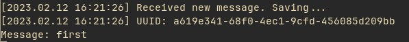
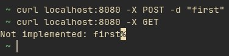
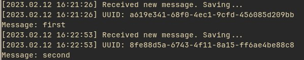
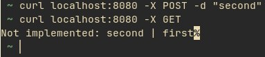

# Sofware Architecture

Tasks for the Software Architecture course

* [Task 1 - Microservices Basics](https://github.com/iamthewalrus67/software-architecture/tree/micro_basics)

## Task 1

After `curl -X POST -d "first"`

Facade service logs:

Client logs (one the left is the response from message service and on the right is the output from logging service):

After `curl -X POST -d "second"`

Facade service logs:

Client logs:

